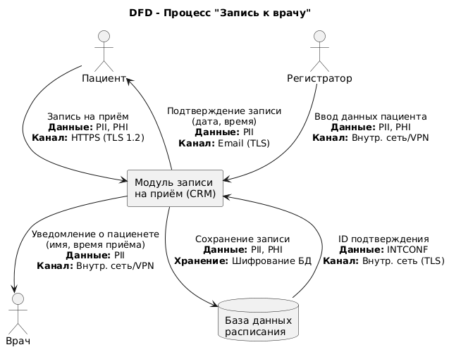
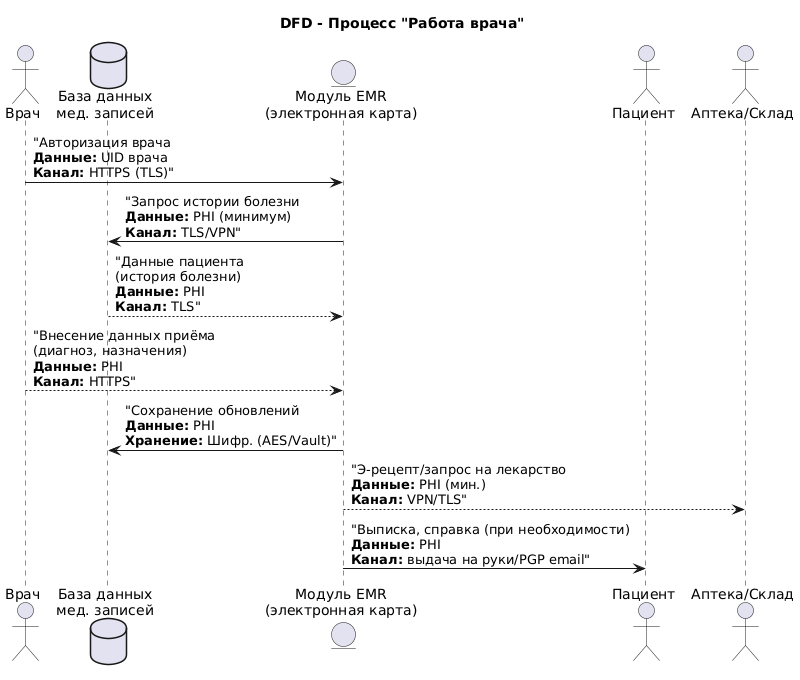
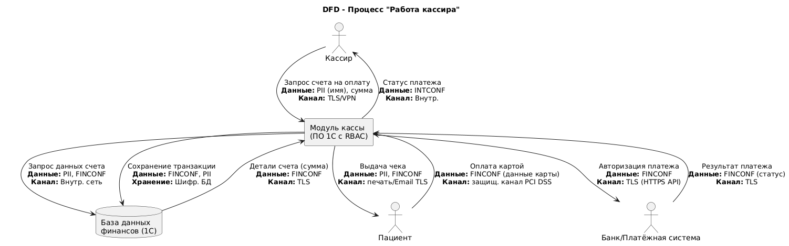
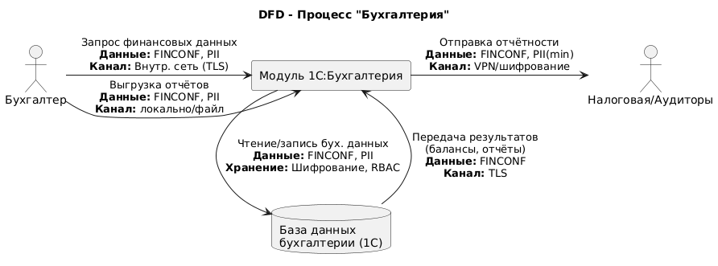
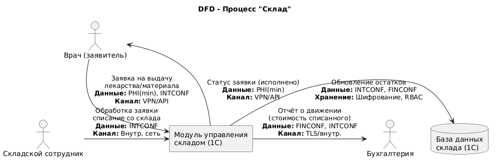

# Проектирование безопасности для системы «Медикаменте»

## Доработанные DFD-диаграммы процессов с мерами защиты

Ниже представлены обновлённые DFD-диаграммы ключевых процессов компании **«Медикаменте»** с указанием категорий данных и применяемых мер безопасности на каждом этапе. В диаграммах используются обозначения категорий данных: **PII** (Personal Identifiable Information – персональные данные), **PHI** (Protected Health Information – медицинские данные), **FINCONF** (Financial Confidential – финансово-конфиденциальные данные), **INTCONF** (Internal Confidential – внутренние конфиденциальные данные).

### Процесс «Запись к врачу»

Пациент обращается для записи на приём. Данные пациента (имя, контакты – PII) и информация о причине обращения (PHI) передаются в систему записи. Внедрены следующие меры защиты на каждом этапе потока данных:

* **Шифрование каналов связи:** Пациент вводит свои данные через защищённый веб-интерфейс. Передача PII/PHI в систему записи осуществляется по HTTPS (TLS 1.2+), исключая перехват данных (конфиденциальность в транзите).
* **VPN для внутренних соединений:** Если запись осуществляется через администратора регистратуры по телефону, то внутренний доступ регистратором к системе проходит через корпоративную сеть или VPN (шифрование трафика внутри офиса).
* **Разграничение доступа:** Система записи (CRM/регистратура) реализует RBAC – только уполномоченные сотрудники (регистраторы) имеют доступ к данным пациентов. Пациент может видеть только свои данные. Доступ врача к расписанию ограничен записями его пациентов (принцип наименьших привилегий).
* **Безопасность хранилища:** Заявка на приём сохраняется в базе данных расписания, которая шифруется на уровне диска и/или поля (например, Transparent Data Encryption, BitLocker для сервера). Данные PII/PHI в БД помечаются тегами классификации (Apache Atlas) для мониторинга и контроля доступа.
* **Уведомления с минимизацией данных:** Пациенту отправляется подтверждение записи (дата, время, врач) по электронной почте. В письме содержится минимум необходимой информации (принцип минимизации данных). Передача письма осуществляется через почтовый сервер с TLS (например, Exchange TLS), либо сообщение доступно в защищённом личном кабинете.
* **Защита уведомлений врачу:** Врач получает уведомление о новой записи через внутреннюю систему – передаются только необходимые данные (имя пациента, время) без лишних деталей истории болезни. Доставка информации врачу проходит по внутреннему зашифрованному каналу (VPN/TLS). Врач заходит в систему под своей учетной записью (с двухфакторной аутентификацией при необходимости) и просматривает расписание через HTTPS.

**Комментарии:** На диаграмме выше показано, как **PII** и **PHI** данные защищаются на всех этапах. Каналы связи шифруются (TLS для внешних соединений, VPN для внутренних). База данных расписания зашифрована, доступ к ней строго ограничен. Данные классифицированы (PII/PHI) для применения политики минимизации доступа. Таким образом, конфиденциальность пациентских данных обеспечена на пути от пациента до врача.

### Процесс «Работа врача»

В рамках данного процесса врач работает с медицинскими данными пациента: просматривает историю болезни, вносит новые записи о приёме, выписывает назначения. На каждом этапе обращения с **PHI** применяются усиленные меры безопасности:

* **Аутентификация и авторизация врача:** Врач входит в медицинскую систему (например, EMR – Electronic Medical Records) через защищённый вход (SSO, Keycloak). Применяется **RBAC** – врачи могут просматривать и редактировать только записи своих пациентов. Дополнительно могут применяться атрибуты (ABAC) – например, доступ к определённым данным возможен только при наличии соответствующей метки безопасности.
* **Шифрование при доступе к данным:** При запросе медицинской карты пациента из БД все соединения проходят по TLS. Врач запрашивает минимально необходимую информацию. Например, результаты исследований, диагнозы и т.д. (PHI) передаются из базы данных на рабочее место врача в зашифрованном виде (HTTPS). Данные на экране обезличены для посторонних – при бездействии экран блокируется, предотвращая несанкционированный просмотр.
* **Безопасность хранения PHI:** База данных медицинских записей (может быть общая с расписанием или отдельная) шифруется и защищается. Данные **PHI** хранятся с сильным шифрованием (например, AES-256) – даже при компрометации сервера данные остаются нечитабельны для злоумышленника. Ключи шифрования хранятся в защищённом хранилище (Vault). Доступ к записям регламентируется политиками Atlas/Ranger по меткам (например, метки «PHI» требуют повышенных прав доступа).
* **Конфиденциальность при назначениях:** Если врач выписывает электронный рецепт или направление, система передаёт эти данные только соответствующим адресатам. Например, рецепт направляется в аптечный модуль/склад, содержащий лишь необходимые сведения (неполные PII – идентификатор пациента, препарат, дозировка). Этот обмен идёт по зашифрованным каналам и доступен только фармацевту. Таким образом, медицинская тайна соблюдается.
* **Логирование действий:** Все действия врача (просмотр карты, редактирование, выписка рецепта) фиксируются в журнале аудита с указанием времени и идентификатора – без записи самих PHI данных, либо с их хешированием. Журналы защищены от изменений и доступны только администрации для контроля.

**Комментарии:** На схеме процесса работы врача **PHI** данные постоянно находятся под защитой. Доступ врача к электронным мед. записям происходит только после аутентификации, а передаются данные по зашифрованным каналам. База данных медицинских карт шифруется, а ключи хранятся в Vault. В рецептах и направлениях, передаваемых на склад, соблюдается принцип минимизации – передаются только необходимые для исполнения сведения (например, код рецепта, лекарство), без избыточных личных данных пациента. При необходимости отправки пациенту выписки на email – содержимое шифруется (например, PGP) или передается через портал с авторизацией. Журнал аудита фиксирует действия врача, что повышает прозрачность и безопасность.

### Процесс «Работа кассира»

Данный процесс охватывает приём оплаты от пациента за оказанные услуги. Здесь задействованы **финансовые данные** и идентификаторы пациентов, поэтому меры безопасности нацелены на защиту платежной информации (FINCONF) и персональных данных (PII):

* **Изоляция платежной информации:** Кассир получает от системы минимальный набор данных о платеже. Из медицинской системы кассиру передаётся только **идентификатор счета/услуги и имя пациента** (для подтверждения личности) – без деталей диагноза (PHI не передается кассиру). Это предотвращает утечку медицинских сведений на этапе оплаты (принцип need-to-know).
* **Шифрование при обмене с банком:** При оплате банковской картой пациент вводит данные карты через POS-терминал или форму, подключенную к банку. Информация карты (номер, CVV – **FINCONF**) сразу шифруется/токенизируется и передается в банк по защищённому каналу (PCI DSS совместимый, TLS). Никакие полные данные карты не сохраняются в системе компании (только токен или последние 4 цифры для отчета).
* **Защита рабочего места кассира:** Программное обеспечение кассы (например, модуль 1С:Касса) работает по защищённому соединению с сервером. Если это тонкий клиент, взаимодействие с сервером 1С происходит по TLS или через VPN. Станция кассира находится в локальной защищённой сети. Рабочая станция шифруется на уровне диска (BitLocker) – данные чеков на ПК не доступны посторонним при физическом доступе. К системе кассы применён RBAC – кассир не может просматривать или изменять медицинские записи, только финансовые операции.
* **Безопасность хранения финансовых данных:** Платёжные транзакции сохраняются в базе данных бухгалтерии/кассы (например, в 1С) с шифрованием на уровне СУБД. К базе применяются роли доступа – только бухгалтерия и руководство могут видеть полные финансовые отчёты. Полные номера карт не хранятся; сохраняются только необходимая информация (время, сумма, маскированный номер счёта) для audit-trail. Любые экспортируемые реестры платежей шифруются при сохранении в файлы (например, с помощью встроенного шифрования или пометки как конфиденциальные с обязательным шифрованием).
* **Квитанция для пациента:** После оплаты кассир выдаёт чек. Если чек отправляется на email, в нём минимум персональных данных; передача по TLS. Электронная копия чека хранится в системе в зашифрованном виде (или на защищённом сервере фискальных данных).
* **Логирование операций:** Все операции кассира (пробитие чека, отмена) логируются в системе аудита. Журналы не содержат полных реквизитов карт (либо они хешируются).

**Комментарии:** На диаграмме работы кассира финансовые данные (FINCONF) строго защищены. Передача данных карты в банк выполняется по зашифрованным каналам, соответствующим стандартам безопасности платежей. Система **не хранит чувствительные платежные данные** (напрямую не сохраняет номер карты, CVV), что соответствует требованиям PCI DSS. База 1С с данными оплат шифруется, а доступ к ней ограничен ролями. Рабочее место кассира защищено шифрованием диска BitLocker, предотвращающим компрометацию данных чеков при краже устройства. Кассиру доступны только необходимые для работы данные о счёте и клиенте – медицинская информация не отображается, обеспечивая конфиденциальность диагнозов при процессе оплаты.

### Процесс «Бухгалтерия»

В процессе работы бухгалтерии происходит агрегирование финансовых данных, подготовка отчётности и взаимодействие с внешними контролирующими органами. Данные здесь относятся к категории **FINCONF** (финансовые) и частично **PII** (персональные данные клиентов/сотрудников в отчетах). Основные меры безопасности:

* **RBAC и разделение зон:** Бухгалтер получает доступ к финансовой информации через учетную запись с ролью «Бухгалтер» в системе (например, 1С:Бухгалтерия). Эта роль позволяет видеть суммарные показатели и необходимые персональные сведения (например, для актов, счетов) но не даёт доступа к медицинским деталям пациентов. Другие сотрудники не имеют доступа к финансовым отчетам.
* **Шифрование данных и резервных копий:** Вся финансовая информация хранится в базе данных бухгалтерии, которая расположена на сервере в защищённом контуре. БД шифруется; регулярные резервные копии шифруются (например, с помощью GPG или средствами СУБД) и хранятся в зашифрованном виде. Это предотвращает утечку финансовых данных в случае компрометации резервной копии.
* **Передача данных во внешние системы:** При необходимости отправки финансовых отчетов (например, налоговой службе или в головной офис) используются только защищённые каналы. Отчеты выгружаются из 1С в файлы, которые шифруются (средствами CryptoPro, GPG или в формате, требуемом регулятором) перед отправкой. Передача может происходить через VPN или по защищённым каналам связи, гарантируя, что конфиденциальные финансовые данные и PII клиентов (если есть в отчёте) не будут перехвачены.
* **Минимизация и обезличивание в отчётности:** Внутренние отчёты формируются без лишних персональных данных, где это возможно. Например, отчеты по выручке содержат агрегированные данные без имён пациентов (PII обезличивается, используются ID или псевдонимы). Если требуется детальный отчет с PII (например, реестр счетов), доступен он только ограниченному кругу лиц.
* **Уничтожение/архивирование данных:** Конфиденциальные финансовые документы и персональные данные в бухгалтерии хранятся строго оговорённый период. По регламенту документы с PII удаляются или архивируются по истечении срока хранения. Например, первичная документация с данными пациентов может храниться 5 лет в активной базе, затем архивироваться. Агрегированные финансовые данные могут храниться дольше для анализа, но без PII. Удаление или обезличивание производится по утверждённому регламенту или по запросу (например, если клиент отозвал согласие на обработку персональных данных).
* **Журналирование действий:** Действия бухгалтеров (формирование/изменение отчётов, выгрузка данных) логируются. Журналы защищены и регулярно просматриваются на предмет аномалий.

**Комментарии:** В процессе бухгалтерии акцент сделан на шифровании финансовых данных и ограничении доступа. Бухгалтерский модуль 1С работает в внутренней сети или дата-центре, доступ через защищённое подключение. Отчётность при передаче наружу шифруется. В диаграмме выше показано, что даже внутри организации данные FINCONF/PII передаются по TLS. Хранилище данных бухгалтерии зашифровано и доступно только по RBAC. Персональные данные клиентов в финансовых сводках по возможности обезличены. Сроки хранения персональных данных соблюдаются – по истечении регламентного периода данные архивируются или удаляются. Например, медицинские счета хранятся 5 лет, а сводные отчёты – 25 лет, в соответствии с требованиями законодательства. Такой подход обеспечивает как безопасность, так и соответствие нормативным требованиям.

### Процесс «Склад» (управление запасами)

Процесс склада охватывает учёт и выдачу медицинских материалов и лекарств. Здесь обрабатываются в основном **внутренние конфиденциальные данные** о запасах (INTCONF) и иногда персональные/медицинские данные, если отслеживается выдача лекарств конкретным пациентам. Предусмотрены следующие меры:

* **Ограничение доступа к системе склада:** Сотрудники склада (кладовщики, фармацевты) работают в системе управления запасами (например, модуль 1С:Склад). Доступ – только у уполномоченных лиц по ролям. Например, врач не имеет прямого доступа к складу, а кладовщик не видит медицинские карты – только заявки на выдачу.
* **Защита данных о запасах:** База данных склада содержит информацию о лекарствах, расходниках, их количестве и движениях (INTCONF). Эти данные не являются общедоступными и могут представлять коммерческую тайну (цены, поставщики). База шифруется на уровне диска. Конфиденциальность обеспечена и в случае компрометации устройства – без ключей (хранящихся в Vault) данные склада не могут быть прочитаны.
* **Связь с медицинской системой по заявкам:** Когда врач выписывает рецепт или запрос на материал, к складу поступает заявка. Эта заявка содержит минимально необходимую информацию: идентификатор пациента или номер рецепта, код товара и количество. Чувствительные **PHI** (диагноз и пр.) не передаются – только то, что нужно для отпуска лекарства. Заявка из медицинской системы приходит по внутреннему защищённому API (через VPN или TLS). На стороне склада она отображается как задание на выдачу, без раскрытия лишних сведений о пациенте.
* **Учет выдачи и обратная связь:** После выдачи лекарства/материала кладовщик отмечает исполнение в системе. Сведения о выданных препаратах могут отправляться обратно в медицинскую систему (отметка в карте, что лекарство получено). Передача этих данных также идёт по защищённому каналу. Данные о том, что пациент получил лекарство, относятся к PHI и помечаются соответствующе; доступ к ним имеет только лечащий врач и необходимые системы.
* **Инвентаризация и отчёты:** Отчеты по складу (остатки, движение товаров) являются **внутренними**. Они доступны только отделу снабжения/склада и частично бухгалтерии (например, для сведения баланса по медикаментам). Передача отчётов в бухгалтерию происходит через интеграцию 1С модулей либо через выгрузку файлов – в обоих случаях по защищённому каналу или внутри единого защищённого контура 1С. Финансовые аспекты (себестоимость, суммы) относятся к FINCONF и защищаются аналогично бухгалтерским данным.
* **Логирование операций склада:** Все выдачи, списания, поступления фиксируются в журнале. В журналах указывается кто и когда выполнил операцию. Эти журналы хранятся на сервере, защищённом от несанкционированного доступа, и позволяют провести расследование при инцидентах (например, недостача).

**Комментарии:** На схеме процесса склада основное внимание уделено внутренней защите данных. Система склада (например, часть ERP 1С) работает внутри корпоративной сети; доступ извне отсутствует или сильно ограничен VPN. Данные о складах шифруются при хранении. Обмен данными с другими модулями (врачи, бухгалтерия) идет по API через защищённые каналы. Передаваемая информация минимизирована: врачу не нужно знать остатки на складе, а складу – диагноз пациента, поэтому в заявках и уведомлениях эти лишние сведения отсутствуют. Финансовые данные о движении товаров (стоимость списанных медикаментов) передаются в бухгалтерию по защищённому каналу, что позволяет учитывать затраты. Доступ к модулю склада разграничен – обычный врач не может просматривать данные склада, а складской сотрудник не видит персональных данных, кроме технических идентификаторов заявок. Это реализует принцип изоляции внутренних конфиденциальных сведений.

