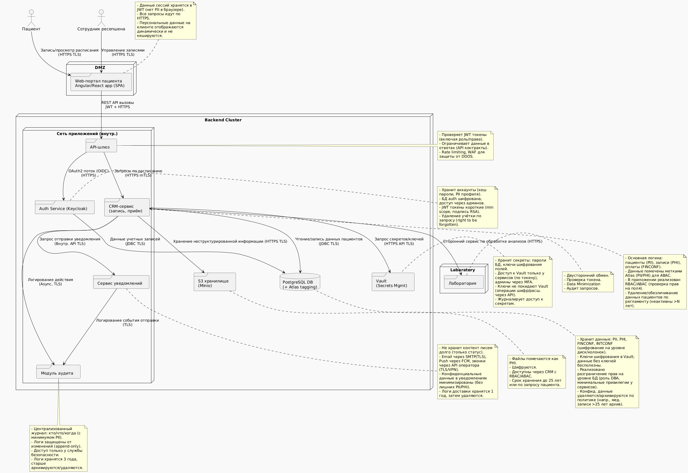

## Проектирование архитектуры To-Be для MVP

Проектирование целевой архитектуры **To-Be** для MVP новой системы, включающей **самостоятельную запись пациента**, доступ для **ресепшена** и функциональность **оповещений**. Архитектура спроектирована с учётом масштабирования нагрузки и повышенных требований безопасности. Ниже представлена диаграмма контейнеров (модель C4) основных компонентов MVP:

* **Web-портал пациента** – веб-приложение, через которое пациенты могут самостоятельно записываться на приём и получать уведомления.
* **CRM-система** – основной бэкенд-сервис, обрабатывающий данные пациентов, расписание, взаимодействие с базой данных (аналог регистратуры/EMR).
* **Сервис авторизации и управления доступом (IAM)** – например, **Keycloak**, для единого управления пользователями (пациентами и сотрудниками), аутентификации (OAuth2/OIDC) и реализации политик доступа (RBAC/ABAC).
* **Сервис уведомлений** – отдельный микросервис для отправки уведомлений пациентам и сотрудникам по различным каналам (email, push-уведомления, голосовые звонки через робота).
* **Модуль аудита действий** – компонент, агрегирующий и хранящий журналы безопасности и действий пользователей (для последующего анализа и соответствия нормативам).
* **Централизованное хранилище данных** – база данных (например, **PostgreSQL**) с включением механизмов мета-данных и секретов: интеграция с **Apache Atlas** для классификации данных (теги PII/PHI/FINCONF/INTCONF) и с **HashiCorp Vault** для управления секретами и ключами шифрования.
* **API-шлюз** – единая точка входа для всех клиентских запросов (с веб-портала или от сотрудников). Шлюз применяет политики безопасности: проверка токенов, ограничение доступа по ролям, а также **принцип минимизации данных** – фильтрация/маскирование полей в ответах, если они не нужны клиенту, и запрет несанкционированных запросов (контроль по контрактам API).

Диаграмма контейнеров ниже отражает взаимодействие этих компонентов. Каждый контейнер сопровождается комментариями о способе хранения данных, мерах защиты и правилах удаления конфиденциальных данных.

---
### **Опционально (детальное описание)**

**Описание архитектуры To-Be:** На диаграмме показано, как компоненты взаимодействуют в новой системе. Ниже приводится структурированное описание каждого контейнера и применённых мер безопасности, включая хранение, удаление данных и защиту при передаче.

* **Web-портал пациента:** Фронтовый веб-интерфейс (SPA), доступный через Интернет по HTTPS. В нём не хранятся постоянные данные – после завершения сессии информация очищается. Авторизация пациента через OAuth2/OpenID Connect (редирект на Keycloak). Все данные, введённые пациентом (PII/PHI), отправляются на сервер по TLS. В браузере кэширование конфиденциальных данных отключено (например, заголовки no-cache). При загрузке расписания или результатов все персональные данные подтягиваются динамически через API и не сохраняются локально. **Удаление данных:** на портале как таковых данных нет, но при запросе удаления аккаунта пациентом – с портала перенаправляется запрос в backend для очистки данных (реализация права на удаление).

* **API-шлюз:** Обрабатывает входящие API-запросы от веб-портала и других клиентов. Выполняет аутентификацию и авторизацию на уровне периметра: проверяет JWT токены, выданные сервисом авторизации. Неправильные или истекшие токены – запрос отклоняется. Шлюз реализует **контроль доступа на уровне API**: каждый маршрут имеет связанный контракт (описание в OpenAPI), и шлюз не пропустит запросы вне контрактного соглашения. Реализован механизм **Data Minimization** – перед отправкой ответа клиенту шлюз может отфильтровать или замаскировать поля, которые не нужны запрашивающей стороне (например, сотруднику ресепшена не возвращаются поля с чувствительными медицинскими данными пациента). Это соответствует принципу GDPR о сборе и использовании только минимально необходимых данных. Также шлюз защищает от перегрузки: лимитирует частоту запросов (rate limiting), и может блокировать подозрительный трафик (WAF, IP filtering). **Хранение данных:** Шлюз не хранит бизнес-данных, лишь временно логирует обращения (в журнал аудита). Логи запросов, содержащие URL и метаданные, хранятся оговорённое время (например, 1 год) для анализа инцидентов, без чувствительного содержимого. **Удаление данных:** Логи шлюза периодически очищаются/агрегируются, персональные идентификаторы в них могут быть хешированы или анонимизированы.

* **Сервис авторизации (Keycloak):** Централизованное хранилище учётных записей пользователей (пациентов и сотрудников). Хранит PII пользователей (имя, email, телефон и пр.) и аутентификационные данные (хешированные пароли, токены сессий). **Хранение данных:** используется собственная база Keycloak (PostgreSQL) – она зашифрована, как и основная БД. Доступ к ней только у администраторов IAM. В Keycloak настроены политики **RBAC** (роли пациента, врача, администратора) и при необходимости ABAC (например, атрибуты пользователей или сессии используются для дополнительных условий доступа). При аутентификации выдается JWT access token с минимально необходимыми **scope** и утверждениями (claims) для сервисов – это гарантирует, что сервис получит только ту информацию о пользователе, которая ему нужна. Токены подписываются устойчивым алгоритмом (RSA256) и проверяются на шлюзе и сервисах. **Передача данных:** все взаимодействие с Keycloak (логин, выдача токена, проверка токена) идёт по HTTPS. **Удаление данных:** По запросу пользователя его учётная запись может быть деактивирована или удалена – при этом персональные данные в профиле стираются или анонимизируются (если не противоречит требованиям хранения). Например, реализовано право на забвение: удаляется имя, контактные данные, но может храниться обезличенный идентификатор для ссылочной целостности. Также, неактивные учетные записи автоматически удаляются/архивируются спустя определённый период.

* **CRM-сервис (запись, приём):** Основной бэкэнд-сервис, реализующий бизнес-логику – запись к врачу, ведение информации о приёмах, счетах и т.п. **Хранение данных:** сервис работает с основной базой данных (**PostgreSQL**), где хранятся все данные пациентов (PII), их медицинская информация (PHI), а также сведения о платежах и договорах (FINCONF) и внутренняя информация (INTCONF). База данных настроена на прозрачное шифрование: применён либо механизм TDE, либо шифрование уровня диска (BitLocker/LUKS) – это защищает данные от прямого доступа в обход приложения. Ключи для шифрования хранятся в Vault, и база получает их при старте или через интеграцию с операционной системой. **Разграничение доступа:** CRM-сервис реализует многоуровневый контроль доступа. На уровне приложения – проверки ролей (RBAC) для различных операций (например, сотрудник ресепшена может создать запись, но не видеть медицинские записи; врач – видеть медкарты своих пациентов, но не финансовые данные и т.д.). Дополнительно, используется **меточное разграничение (ABAC)**: чувствительные поля помечены в Atlas как PII/PHI, и перед возвратом данных сервис проверяет права. Например, если запрос идёт от роли "Регистратор", поля с PHI (диагноз) не включаются в ответ. Эту логику поддерживают либо явные условия в коде, либо интеграция с политиками Atlas/Ranger. **Передача данных:** CRM-сервис принимает запросы только от API-шлюза (внутренний трафик). Взаимодействие с БД – через TLS подключение, с удостоверением сервера БД. При запросах к внешним системам (например, сервису уведомлений) – используются сервисные аккаунты и TLS. **Удаление данных:** сервис отвечает за применение политик хранения. Например, если пациент удалил аккаунт – CRM помечает его записи для удаления и удаляет PII по нормативу (медицинские записи могут быть обезличены и сохранены статистически, а личные данные пациента – удалены). Медицинские записи хранятся в системе столько, сколько требует закон (например, 25 лет), после чего архивируются в защищённом виде или удаляются, если позволяют правила. Финансовые транзакции хранятся согласно требованиям бухгалтерии (например, 5-10 лет). Все эти правила реализованы либо через планы архивирования БД, либо через планировщик в приложении.

* **Сервис уведомлений:** Микросервис, отвечающий за отправку уведомлений клиентам и сотрудникам по разным каналам. Он получает запрос от CRM (например, отправить пациенту подтверждение записи или напоминание о приёме) вместе с необходимыми данными. **Минимизация и шифрование контента:** передаваемые в сервис уведомлений данные содержат только то, что нужно для сообщения. Например, для email-напоминания – имя пациента и дата/время приёма, без медицинских деталей. Сервис шаблонизирует сообщение и отправляет через соответствующий канал. Email отправляется через корпоративный SMTP-сервер по TLS (используется, например, протокол SMTPS с обязательным TLS-шифрованием до сервера получателя). Push-уведомления отправляются через сторонние сервисы (Firebase/APNS) – соединение с ними идёт по HTTPS. Голосовые уведомления (робот-звонок) – либо через интеграцию с IP-телефонией внутри организации (по VPN), либо через API голосового сервиса с шифрованием. **Хранение данных:** сам сервис уведомлений по возможности не сохраняет полные тексты сообщений после отправки. Он может вести только очередь сообщений и статус доставки. Эти данные (включая возможно часть PII – например, email адрес, номер телефона) хранятся в БД уведомлений (может быть внутри того же Postgres, в отдельной схеме) короткое время. После успешной отправки содержимое сообщения удаляется, остаётся только отметка о факте отправки. **Удаление данных:** Логи и статусы хранятся, скажем, год для разборов (например, был ли доставлен email), затем автоматически очищаются. Контактные данные берутся из CRM по запросу и не дублируются в сервисе уведомлений, чтобы не размножать PII. **Безопасность доступа:** сервис уведомлений не напрямую доступен снаружи – только внутренний CRM может давать ему команды, а он – отправлять наружу. Настройки SMTP/email (учётные записи, API-ключи) хранятся в Vault и подтягиваются сервисом динамически, что исключает их хранение в коде или в конфиге.

* **Модуль аудита:** Горизонтальный компонент, собирающий логи безопасности и действий. Сюда поступают события от API-шлюза (доступы, ошибки авторизации), от CRM (бизнес-события: создание записи, просмотр записи врачом – без раскрытия содержимого, просто факт), от сервиса уведомлений (отправлено письмо X адресату Y) и от самого Keycloak/IAM (логины, изменения паролей). **Хранение данных:** Модуль аудита может использовать отдельное хранилище (например, Elasticsearch/ELK stack либо таблицы в Postgres, выделенные под логи). Данные аудита помечаются как **INTCONF** – они содержат внутреннюю информацию, а также минимально необходимые PII (например, идентификатор пользователя, возможно имя если необходимо, но можно и ID ограничиться). По возможности PII в логах избегаются или хешируются (например, вместо имени пациента в логе действия – его ID или обезличенный токен). Все записи защищены от редактирования: настроено право только на добавление (append-only). Администраторы безопасности имеют доступ на чтение этих логов через специальные инструменты, с многофакторной аутентификацией. **Удаление данных:** логи хранятся ограниченное время, соответствуя политике компании или требованиям регулятора. Например, журналы аудита хранятся 3 года, после чего архивируются в офлайн-хранилище или удаляются, если срок давности истёк. При архивировании также обеспечивается шифрование архива и хранение его в защищенном месте. **Передача данных:** отправка логов от сервисов в модуль аудита происходит либо асинхронно (по защищённой шине/очереди, например, Kafka с TLS) либо через внутренний API. Все эти каналы шифруются, чтобы исключить перехват информации о внутренних событиях.

* **Хранилище данных (Postgres + Atlas + Vault):** Центральная база данных, где хранятся все основные сведения. **Структура хранения:** использует PostgreSQL, развернутый в безопасном сегменте сети (доступ только с серверов приложений). **Шифрование:** на уровне диска включено полное шифрование тома (BitLocker для Windows Server или LUKS для Linux) – это предотвратит компрометацию при физическом доступе к дискам. Дополнительно, включено шифрование отдельных чувствительных столбцов/таблиц с использованием функций PostgreSQL (pgcrypto, либо сторонние расширения) – например, поля с номерами документов, результаты анализов могут храниться в зашифрованном виде, расшифровываясь приложением на лету при наличии ключа. **Управление ключами:** все ключи хранятся и управляются в Vault. Приложения не хранят ключи локально, а запрашивают их у Vault когда нужно (либо используют Transit API Vault, который шифрует/дешифрует данные без выдачи ключа). Таким образом, даже при проникновении в БД злоумышленник не сможет прочесть поля без доступа к Vault, который изолирован. По сути, если атака на базу произойдёт, данные останутся зашифрованными и бесполезными без ключей. **RBAC на уровне БД:** настроены роли БД – приложения подключаются под ограниченными учетными записями, которые имеют права только на нужные схемы/процедуры. Прямого доступа к БД пользователей нет, только через приложения. Администратор БД (DBA) имеет свою учетку, но действия DBA контролируются (включён AUDIT на уровне СУБД). **Atlas и классификация:** Apache Atlas интегрирован для ведения **каталога данных**. Каждая таблица/колонка, содержащая PII, PHI, FINCONF, INTCONF, помечена соответствующим тегом. Эти теги используются для построения **политик безопасности** – например, в Apache Ranger или аналогичном решении можно задать, что данные с тегом PHI доступны только определённым сервисам/ролям. Даже внутри БД, если разные схемы для разных модулей, можно разграничивать доступ по меткам/правилам. **Удаление данных:** Очень важен жизненный цикл данных. В БД настроены процедуры и политики для удаления или архивирования записей по наступлению событий: истечение срока хранения, отзыв согласия субъектом, требование регулятора. Например, личные данные пациента, который не посещал клинику более N лет, могут быть автоматически обезличены (имя, контакты удаляются, вместо них случайный идентификатор, а медицинская часть остается для статистики). Или по истечении 25 лет медицинская карта перемещается в архивную базу (отдельный зашифрованный архив), а из основной удаляется. Запросы пациента на удаление (если это не противоречит закону) выполняются: архивируются его записи и удаляются персональные идентификаторы. **Защита при передаче данных:** все подключения к БД (от CRM, от Auth) требуют TLS-соединения с проверкой сертификата сервера. Администраторы подключаются к БД только через VPN и с использованием клиентских сертификатов. Резервные копии БД шифруются (ключ в Vault) и перед сохранением на резервный носитель также маркируются как "Confidential".

* **HashiCorp Vault (секреты и ключи):** Отдельный контейнер (сервис) в инфраструктуре, обеспечивающий управление секретами. Vault не напрямую часть C4-модели приложений, но интегрирован: CRM-сервис обращается в Vault за секретами (например, пароль доступа к SMTP для сервиса уведомлений, учетные данные к внешним API) и за ключами шифрования для работы с данными. **Безопасность Vault:** Доступ к Vault строго ограничен – только авторизованные сервисы (с JWT или AppRole) могут читать нужные секреты. Администраторы Vault заходят с MFA и только с внутренней сети. В Vault все секреты разделены по политикам (например, сервис уведомлений имеет доступ только к почтовым настройкам, CRM – к ключам шифрования БД, и т.д.). **Ключи шифрования данных:** хранятся в **Transit Engine** Vault – при шифровании/расшифровке данных CRM может вызывать API Vault, и Vault вернёт только результат, не раскрывая ключ. Таким образом, даже сами приложения никогда не видят ключи в открытом виде. **Логирование:** Vault ведёт полный лог доступа к каждому секрету (кто запросил, когда) – это интегрируется в общий аудит. **Удаление/ротация секретов:** секреты регулярно ротируются – например, пароли к БД меняются каждые 90 дней автоматически (Vault может интегрироваться с DB для динамических секретов). При увольнении сотрудника его персональные доступы в системе отзываются и секреты, к которым он мог иметь косвенный доступ, меняются. Все эти меры гарантируют, что компрометация одного компонента не приведёт к полному компрометированию данных системы.

**Масштабирование и устойчивость:** Спроектированная архитектура учитывает рост нагрузки. Web-портал (SPA) может обслуживаться через CDN и масштабироваться на уровне веб-серверов. API-шлюз – без сохранения состояния (stateless), его можно реплицировать и балансировать (например, несколько экземпляров Nginx/Kong или AWS API Gateway). Keycloak (Auth) поддерживает кластеризацию – несколько узлов для отказоустойчивости, общая репликация БД. CRM-сервис и сервис уведомлений разработаны как микросервисы, их можно развернуть в контейнерах (Docker/Kubernetes) и масштабировать горизонтально при увеличении числа пользователей. Модуль аудита может использовать масштабируемое хранилище (например, Elasticsearch кластер) для больших объёмов логов. База данных настроена с возможностью шардирования или как минимум с репликой для чтения – это обеспечит масштабирование по чтению и резерв на случай сбоя. Vault также может быть настроен в HA-режиме (кластер с взаимным консенсусом) чтобы избежать единой точки отказа. Внутренняя сеть разделена на зоны безопасности (DMZ для портала и API, внутренний сегмент для данных) с межсетевыми экранами. Также применяется мониторинг и IDS/IPS для обнаружения аномалий.

Таким образом, предлагаемая архитектура **MVP** обеспечивает как высокую степень безопасности (шифрование, контроль доступа, аудит), так и готовность к масштабированию. Все конфиденциальные данные проходят по защищённым каналам и хранятся с шифрованием, а правила их хранения и удаления соответствуют принципам минимизации данных и требованиям законодательства. Это создает прочный фундамент для дальнейшего развития системы «Медикаменте» с соблюдением приватности пациентов и безопасности информации.
